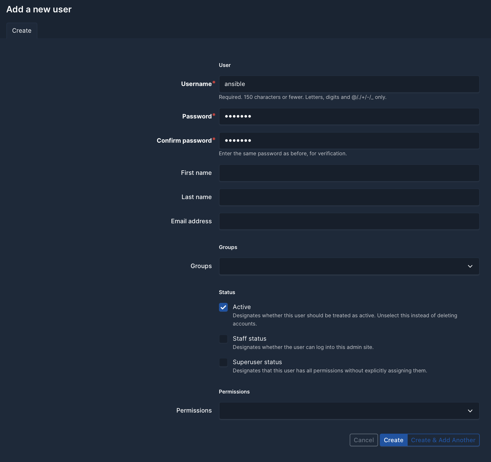

# Using NetBox DNS with Ansible
NetBox DNS has been designed to provide an intuitive and user-friendly solution for managing DNS data within NetBox. This document provides an overview of how NetBox DNS data can be used to populate DNS servers with configuration and zones. It is not intended to be a comprehensive guide to a DNS provisioning system suitable for production, but rather to illustrate the capabilities of NetBox DNS and the NetBox API.

This example uses Ansible and the `NetBox.NetBox` collection from Ansible Galaxy to show how a very simple integration can be implemented.

## Preparing NetBox
In order to utilise the NetBox API, a user account with an authentication token must be created. For the specified purpose, a read-only user with access to the NetBox DNS data is sufficient.

A new user, named 'ansible', is created using the NetBox Admin interface. The password is not required and should be sufficiently secure. Any random password of a reasonable length will suffice.



In the next step, a permission to view all NetBox DNS data must be created and assigned to the user just created.


Once the form has been submitted, the new 'ansible' user will be able to view all DNS data within NetBox. The final step is to assign that user an API authentication token. This can be done by selecting the 'API Token' navigation menu item and clicking on 'Add Token'. Select the 'ansible' user and uncheck 'Write enabled'. The token will be displayed immediately in that view.


## Preparing Ansible
For the `netbox.netbox` collection to function correctly, a recent version of Ansible running under Python 3 is required. Python 2 is no longer supported and the NetBox collection is known not to work properly with Python 2.

### Installing the `netbox.netbox` collection for Ansible
Installing the collection is straightforward.

```
# ansible-galaxy collection install netbox.netbox
Starting galaxy collection install process
Process install dependency map
Starting collection install process
Downloading https://galaxy.ansible.com/api/v3/plugin/ansible/content/published/collections/artifacts/netbox-netbox-3.17.0.tar.gz to /root/.ansible/tmp/ansible-local-219358jiz3hc9y/tmpgngehv3q/netbox-netbox-3.17.0-ywot9syj
Installing 'netbox.netbox:3.17.0' to '/root/.ansible/collections/ansible_collections/netbox/netbox'
netbox.netbox:3.17.0 was installed successfully
```

### Installing the `pynetbox` Python 3 Module
The `netbox.netbox` collection requires the `pynetbox` module to be installed.

```
# pip3 install pynetbox
Collecting pynetbox
  Downloading pynetbox-7.3.3-py3-none-any.whl.metadata (3.6 kB)
Requirement already satisfied: requests<3.0,>=2.20.0 in ./lib64/python3.11/site-packages (from pynetbox) (2.31.0)
Collecting packaging<24.0 (from pynetbox)
  Using cached packaging-23.2-py3-none-any.whl.metadata (3.2 kB)
Requirement already satisfied: charset-normalizer<4,>=2 in ./lib64/python3.11/site-packages (from requests<3.0,>=2.20.0->pynetbox) (3.3.2)
Requirement already satisfied: idna<4,>=2.5 in ./lib64/python3.11/site-packages (from requests<3.0,>=2.20.0->pynetbox) (3.6)
Requirement already satisfied: urllib3<3,>=1.21.1 in ./lib64/python3.11/site-packages (from requests<3.0,>=2.20.0->pynetbox) (2.1.0)
Requirement already satisfied: certifi>=2017.4.17 in ./lib64/python3.11/site-packages (from requests<3.0,>=2.20.0->pynetbox) (2023.11.17)
Downloading pynetbox-7.3.3-py3-none-any.whl (34 kB)
Using cached packaging-23.2-py3-none-any.whl (53 kB)
Installing collected packages: packaging, pynetbox
  Attempting uninstall: packaging
    Found existing installation: packaging 24.0
    Uninstalling packaging-24.0:
      Successfully uninstalled packaging-24.0
Successfully installed packaging-23.2 pynetbox-7.3.3
```

### Testing the API connection
Now the API connection can be tested by performing a simple lookup against NetBox. For the given purpose it is sufficient to use the `nb_lookup` plugin.

```
# ansible -m debug -a "msg={{ query('netbox.netbox.nb_lookup', \
                                    'nameservers', \
                                    plugin='netbox_dns', \
                                    api_endpoint='https://netbox.example.com/', \
                                    token='f52d8887c576df4064139e4208cca481b95110f9') }}" localhost
```
The return value confirms that the user and its permissions have been correctly set up and that the token can be used to authenticate against NetBox and access data from NetBox DNS.

```
localhost | SUCCESS => {
    "msg": [
        {
            "key": 1,
            "value": {
                "created": "2024-03-28T20:12:34.175720Z",
                "custom_fields": {},
                "description": "",
                "display": "ns1.example.com",
                "id": 1,
                "last_updated": "2024-03-28T20:12:34.175735Z",
                "name": "ns1.example.com",
                "tags": [],
                "tenant": null,
                "url": "https://netbox.example.com/api/plugins/netbox-dns/nameservers/1/",
                "zones": []
            }
        }
    ]
}
```

### Generating zone files from NetBox DNS data
In the final step of this example, NetBox DNS data is used to create zone files for e.g. a BIND nameserver.

#### Zone file template
A simple Jinja2 template to create a zone file is stored as `zone.db.j2`:

```
;
; Zone file for zone {{ zone.name }}
;

$TTL {{ zone.default_ttl }}


{{ record.name.ljust(32) }}    {{ (record.ttl|string if record.ttl is not none else '').ljust(8) }} IN {{ record.type.ljust(8) }}    {{ record.value }}

```

### Generate All Views and Zones from NetBox Using Ansible

Required parameters include:

- `netbox_url`: The URL of the NetBox instance, e.g., `https://netbox.example.com/`
- `netbox_token`: previously generated token
- `zone_file_path`: Folder for the zones on the bind server

The example playbook `generate_bind_config.yaml` generates a `named.conf.local` file, which creates all zones from Netbox on the BIND server.

**Note: Without additional configurations, an incorrect file will be generated if multiple views with the same zone names are used. In this case, the parameters must be manually provided to specify when each zone should be addressed in each view. This example is only intended to provide a general starting point.**

The example playbook `synchronize_dns_zones.yaml` can be used to generate all views, zones, and corresponding records from NetBox using Ansible. These zone files are compatible with BIND 9.

This Ansible playbook will create a directory for each view within the specified folder (`zone_file_path: '/path_to_your_zone_files/'`) and generate the corresponding zone files for each view within these directories.

If views or zones are deleted in NetBox, they will also be removed from the directories. This deletion occurs after creating the legitimate folders and files to prevent a change event with each execution of the playbook. If changes are detected, the BIND 9 service on the server will be restarted.

The playbook `delete_dns_files.yaml` must be in the same directory as the `synchronize_dns_zones.yaml` playbook, or the path in the `include_task` must be adjusted accordingly.
